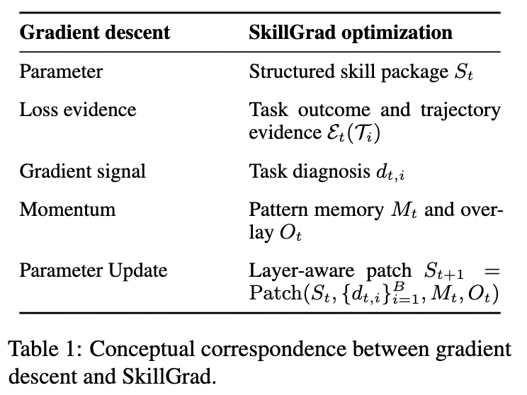
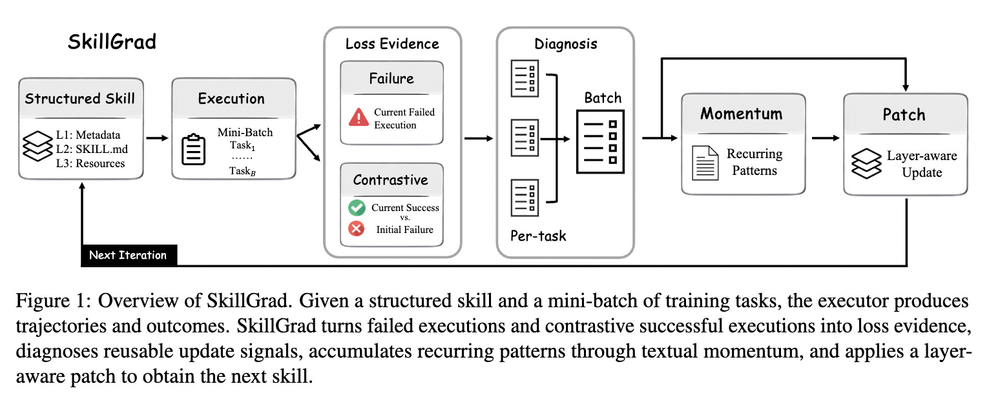
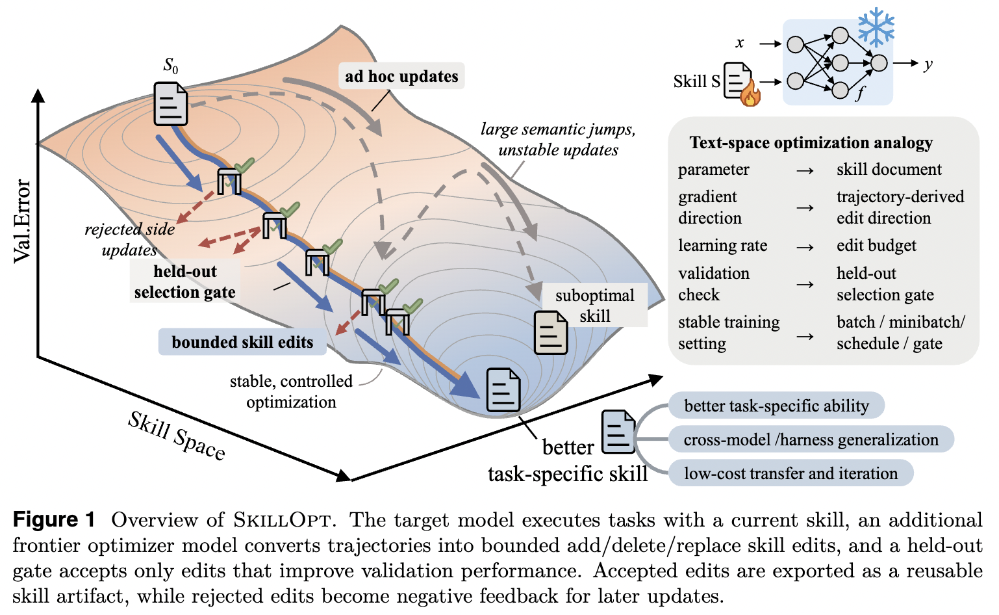

# Paper Summaries

## Table of Contents

1. [SkillGrad: Optimizing Agent Skills Like Gradient Descent](#1-skillgrad-optimizing-agent-skills-like-gradient-descent)
2. [SkillOpt: Executive Strategy for Self-Evolving Agent Skills](#2-skillopt-executive-strategy-for-self-evolving-agent-skills)
3. [SkillFlow: Scalable and Efficient Agent Skill Retrieval System](#3-skillflow-scalable-and-efficient-agent-skill-retrieval-system)

---

## 1. SkillGrad: Optimizing Agent Skills Like Gradient Descent

**ArXiv:** https://arxiv.org/abs/2605.27760  
**Code:** https://github.com/wwwhy725/SkillGrad

> **Background — What is an Agent Skill?**  
> Agent skills provide a lightweight way to adapt LLM agents to specialized domains by storing reusable procedural knowledge in structured files.
>
> <details>
> <summary><strong>More background</strong></summary>
>
> Many practical agent applications require more than general problem-solving ability. In specialized, procedure-heavy domains, such as codebase maintenance, agents must repeatedly follow domain-specific workflows.
>
> Adapting agents to various domains through approaches such as fine-tuning can be costly, especially when the needed knowledge is procedural rather than purely factual.
>
> To bridge this gap, agent skills offer a lightweight alternative. Unlike a flat prompt, a skill is a structured artifact.
>
> Skill quality matters a great deal. That raises a natural question: can we treat a skill as an optimizable artifact and systematically improve it after initialization?
>
> </details>

> **Current challenges**  
> - These skills are often unreliable, incomplete, or outdated.
> - Existing skill-evolution methods often address these deficiencies through heuristic reflections without an explicit optimization formulation.

> **This work**  
> SkillGrad is a gradient descent-inspired framework for optimizing agent skills. It treats the skill package as a structured parameter and optimizes it in a gradient-descent-like loop:
>
> 1. **Loss evidence** — Task executions produce trajectory-level outcomes that serve as loss signals. At each iteration, the current skill is executed on a mini-batch of tasks, producing outcomes and trajectories as loss evidence.
> 2. **Text-based gradients** — Automatic diagnoses convert that evidence into correction directions (analogous to per-example gradients).
> 3. **Momentum** — A momentum agent accumulates recurring diagnostic patterns into a persistent memory overlay, stabilizing optimization across iterations.
> 4. **Parameter update** — An LLM-based patcher applies layer-aware edits to the skill package, producing the next version of the skill.
>
> <p align="center"></p>
>
>   


> **Benchmarks**  
> - **SpreadsheetBench Verified**
> - **WikiTableQuestions**

---

## 2. SkillOpt: Executive Strategy for Self-Evolving Agent Skills

**ArXiv:** https://arxiv.org/abs/2605.23904  
**Code:** https://github.com/microsoft/SkillOpt

> **Background**  
> - **Skill** — A skill is a portable natural-language artifact that packages procedures, domain heuristics, tool policies, output constraints, and failure modes, letting a frozen agent adapt through external text.
> - **Harness** — In this paper, a harness is the execution environment that runs the frozen target model on tasks. The paper uses three harnesses: direct chat, Codex, and Claude Code.
>
>   <details>
>   <summary><strong>More on harnesses</strong></summary>
>
>   **1. Direct Chat Harness**
>
>   This is the simplest harness.
>
>   Imagine opening ChatGPT and typing:
>
>   ```
>   User: Solve this math problem.
>   ```
>
>   The model receives:
>
>   ```
>   [System Prompt]
>   You are a helpful assistant.
>
>   [Skill]
>   Break the problem into steps.
>   Verify calculations before answering.
>
>   [User]
>   Solve this math problem.
>   ```
>
>   Then the model answers once.
>
>   **Workflow**
>
>   ```
>   User Question
>         ↓
>      LLM
>         ↓
>   Final Answer
>   ```
>
>   No tools. No coding environment. No file system. No iterative execution.
>
>   This is what they call **Direct Chat**.
>
>   **2. Claude Code Harness**
>
>   Claude Code is much closer to an autonomous coding agent.
>
>   Suppose the task is:
>
>   ```
>   Find the bug in this repository and fix it.
>   ```
>
>   The harness lets the model do things such as:
>
>   ```
>   ls
>   cat file.py
>   grep
>   edit file.py
>   run tests
>   ```
>
>   The interaction becomes:
>
>   ```
>   User
>    ↓
>   Claude Code Harness
>    ↓
>   LLM decides next action
>    ↓
>   Run command
>    ↓
>   Observe result
>    ↓
>   LLM decides next action
>    ↓
>   ...
>   ```
>
>   **Example:**
>
>   ```
>   Thought:
>   I should inspect the repository.
>
>   Action:
>   ls
>
>   Observation:
>   src/
>   tests/
>
>   Thought:
>   Open the failing file.
>
>   Action:
>   cat src/model.py
>   ```
>
>   and so on.
>
>   The model is still frozen.
>
>   The harness provides:
>
>   - terminal access
>   - file editing
>   - execution environment
>   - looping
>
>   </details>

> **This work**  
> - The skill should be trained as the external state of a frozen agent.
> - **SkillOpt** is a controllable text-space optimizer for agent skills.
> - **SkillOpt** is harness-agnostic (the same optimizer can work across different execution environments, such as direct chat, Codex, and Claude Code).
>
> > **Terminology**
> > - **Target model** — The frozen LLM that actually runs tasks with the skill; SkillOpt adapts this agent by editing the skill, not the model weights.
> > - **Frontier optimizer model** — A separate LLM used only during training to read rollouts and propose skill edits.
>
> - At deployment, the agent uses only the learned skill and the frozen target model—no separate optimizer model is called.
>
> 

> **Evaluation**
>
> > **Benchmarks**
> > - **SearchQA**
> > - **SpreadsheetBench**
> > - **OfficeQA**
> > - **DocVQA**
> > - **LiveMathematicianBench**
> > - **ALFWorld**
>
> > **Execution harnesses**
> > - **Direct chat**
> > - **Codex**
> > - **Claude Code**  
>
> > **Target models**
> > - **GPT-5.5**
> > - **GPT-5.4**
> > - **GPT-5.4-mini**
> > - **GPT-5.4-nano**
> > - **GPT-5.2**
> > - **Qwen3.5-4B**
> > - **Qwen3.6-35B-A3B**
>
> > **Baselines**
> > - **No skill**
> > - **Human skill**
> > - **One-shot LLM skill**
> > - **Skill evolution:** **Trace2Skill**, **EvoSkill**
> > - **Prompt optimization:** **TextGrad**, **GEPA**

---

## 3. SkillFlow: Scalable and Efficient Agent Skill Retrieval System

**ArXiv:** https://arxiv.org/abs/2504.06188  
**Code:** https://github.com/IBPA/skill-flow

> _Summary placeholder — fill in later._
